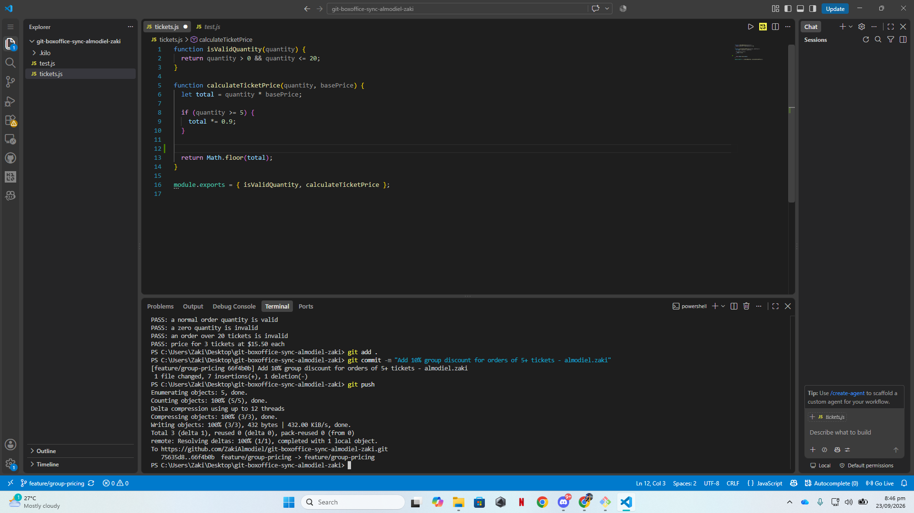
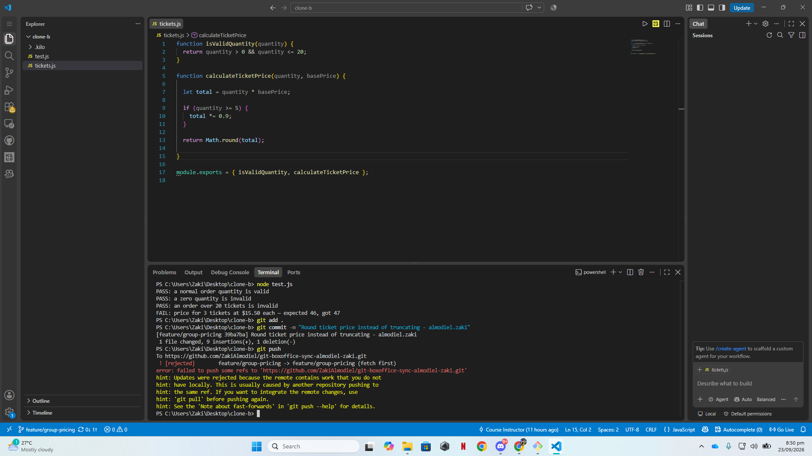
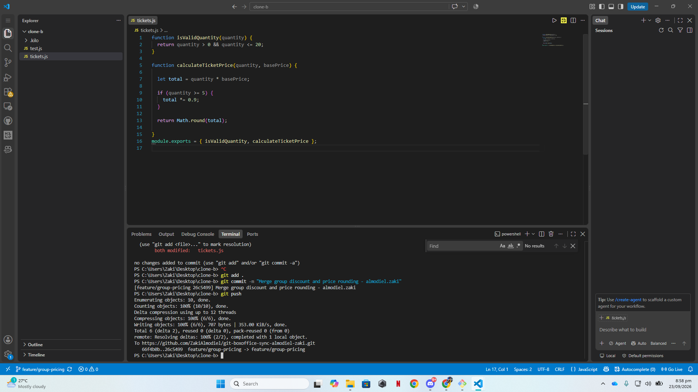
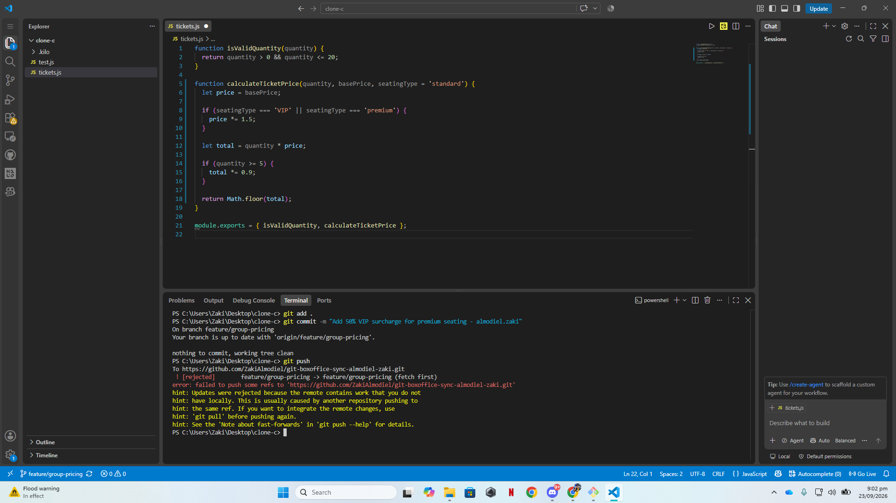
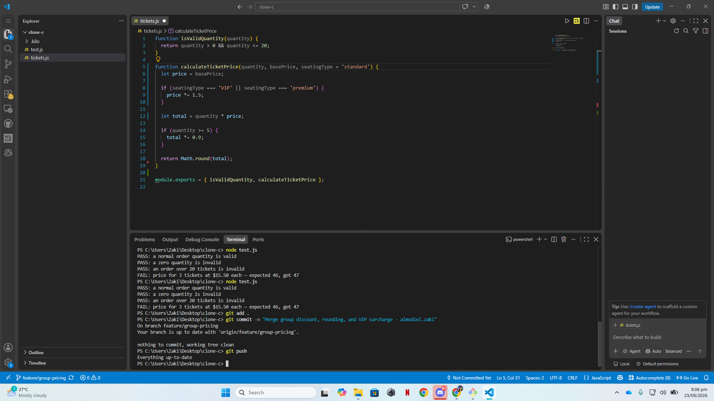
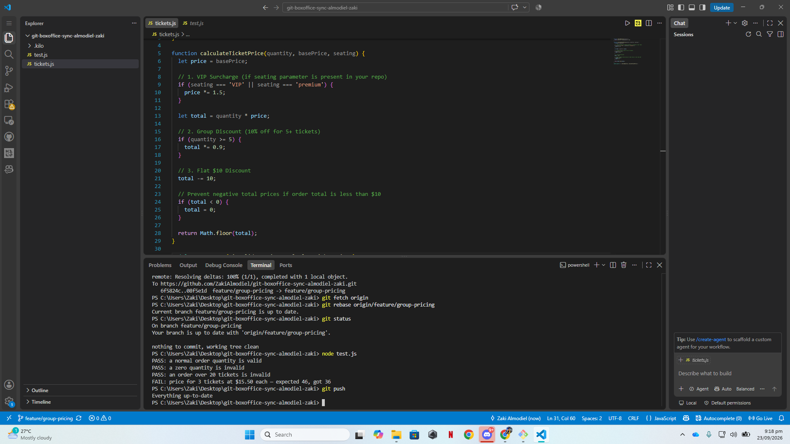
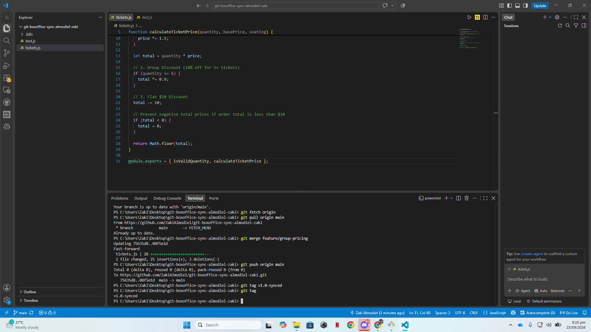

# Box Office Sync — Workflow

## Task 1 — Group Discount

Clone A added/preserved the 10% group discount for orders with 5 or more tickets. The change was committed and pushed to `feature/group-pricing`.

## Task 2 — Rounding Change and Rejected Push

Clone B changed the ticket price calculation from truncating the result with `Math.floor()` to rounding the result with `Math.round()`. The push was rejected because Clone B had not fetched Clone A's newer remote commit.

## Task 3 — Two-Way Merge

Clone B fetched the latest remote branch and merged it. The conflict involved the group-discount work from Clone A and the rounding work from Clone B.

The conflict was resolved so that both behaviors remained. The group discount still applies to orders of 5 or more tickets, while the final price uses rounding instead of truncation. The tests passed before the result was pushed.

## Task 4 — VIP Surcharge and Rejected Push

Clone C started from the older version of the branch and added a 50% surcharge for premium/VIP seating. Its push was rejected because the remote branch had already advanced with the work reconciled by Clone B.

## Task 5 — Three-Way Merge

Clone C fetched the latest remote branch and merged it. This conflict was more complicated because three contributors' work had to be preserved: the group discount, rounding, and VIP surcharge.

The conflict was resolved manually so that all three behaviors remained in the final calculation. The tests were run after resolving the conflict and the branch was pushed successfully.

## Task 6 — Rebase

Clone A then added a flat $10 discount without first synchronizing with the newer remote branch, so its push was rejected.

Instead of merging, the branch was reconciled using `git fetch` followed by `git rebase`. Conflicts occurred in more than one file. They were resolved while preserving all four behaviors:

* 10% group discount for 5 or more tickets
* price rounding
* 50% VIP surcharge for premium/VIP seating
* flat $10 discount

After the conflicts were resolved, the tests were run and the rebased branch was pushed without force.

## Task 7 — Main Branch and Tag

The completed `feature/group-pricing` branch was merged into `main`. The updated `main` branch was pushed to GitHub. The final commit was tagged `v1.0-synced`, and the tag was pushed to GitHub.

# Required Questions

## 1. Walk through the final `calculateTicketPrice` function and name which contributor's change is responsible for each part.

The final `calculateTicketPrice` function combines four changes.

**Group discount — Contributor A:**
The function applies a 10% discount when the order contains 5 or more tickets.

**Rounding — Contributor B:**
The function uses `Math.round()` instead of `Math.floor()`, so the calculated price is rounded instead of truncated.

**VIP surcharge — Contributor C:**
The premium/VIP seating condition adds a 50% surcharge.

**Flat $10 discount — Contributor A's later change:**
A flat $10 discount is applied to the order.

Together, these changes make the final function contain the original ticket-price calculation plus all four requested behaviors.

## 2. Compare Task 3's two-way conflict to Task 5's three-way conflict — what got harder with a third line of work?

Task 3 involved reconciling two different changes: the group discount and the rounding change.

Task 5 was harder because a third contributor had made another change before the branch was reconciled. The conflict therefore required checking three different pieces of work and making sure none of them was accidentally removed.

With three contributors, it becomes easier to keep one change while accidentally losing another. The final code had to be checked against all three required behaviors.

## 3. Task 6's flat $10 discount changed the expected result of tests unrelated to your change (the group-discount and VIP tests). Why, and what does that tell you about "isolated" changes in shared code?

The flat $10 discount changes the final value returned by the shared `calculateTicketPrice` function. Tests for the group discount and VIP behavior also depend on that final returned price.

Therefore, even though the $10 discount is a separate feature, it can change the expected results of tests for other features that use the same calculation.

This shows that a change can be logically separate but still affect other features when they depend on shared code or shared output.

## 4. If this were a real team of three, what one process change would have prevented all three rejected pushes?

The team could require everyone to synchronize with the remote branch before starting and pushing work. Contributors could fetch the latest branch before making changes and communicate when they are modifying the same shared function.

This would reduce the chance of several people working from outdated copies of the same code and discovering conflicts only when they try to push.
